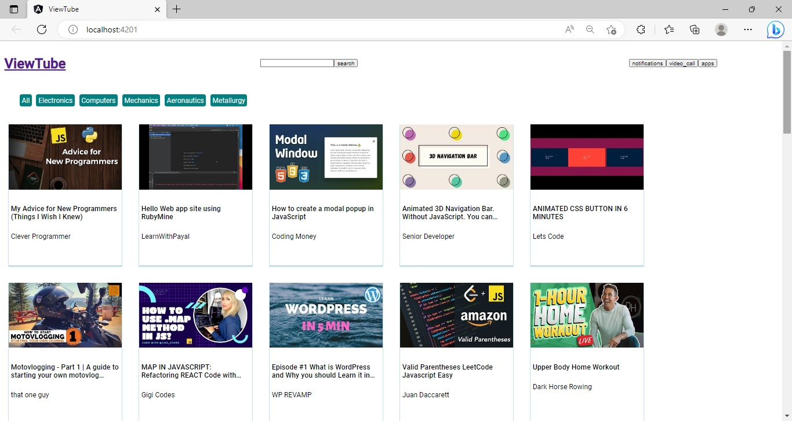
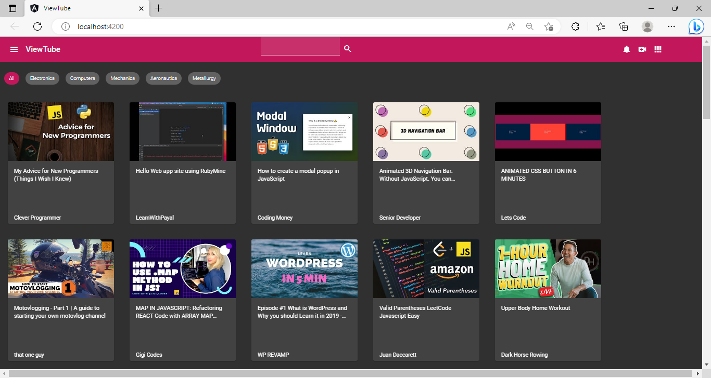
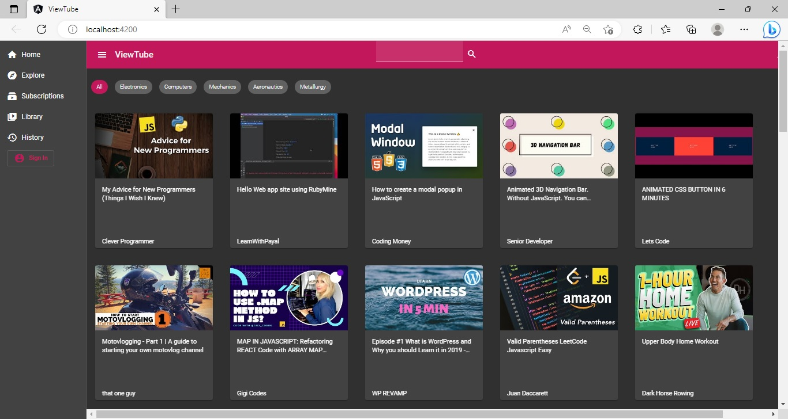

## Practice - Style an Angular Application using Angular Material

This sprint has 1 practice.

### Points to Remember

- The Angular Material components should only be used for styling the application.
- The Angular Material component selectors should not be used to define the CSS style properties. 
    - Instead, define `id` or `class` attributes on the elements and use them as CSS selectors to define the style rules.

### Instructions for Practice

- Fork the boilerplate into your own workspace. ​​​
- Clone the boilerplate into your local system. ​​​
- Open command terminal and set the path to the folder containing the cloned boilerplate code.​​​
- Run the command `npm install` to install the dependencies.​
- Open the folder containing the boilerplate code in `VS Code`.​​
- Style the `ViewTube` application and generate the output as shown in the `view-tube-expected-output.jpg` file. This file is located inside the `resources` folder.

Notes:​
1. The solution of this practice will undergo an automated evaluation on the `CodeReview` platform. (Local testing is recommended prior to the testing on the `CodeReview` platform)​
2. The test cases are available in the boilerplate.​

### Context

The application `ViewTube` is a single-page application that allows users to view a list of videos.

This application has been designed using Angular and is styled using CSS properties.

As an Angular front-end developer, you are required to style the `ViewTube` application using the Angular Material components and themes.

#### About the Partial Code and Data File
- The boilerplate contains the code for the `ViewTube` application.
    - This code is fully functional and has the required components created with minimal style effects that are produced using the CSS style properties.
- The list of videos used in the application is defined in the `.ts` file for Angular service named `VideoService`. The file is located inside the `services` folder of the `app` folder.
    - The code in the `.ts` files should not be modified.
- Run the application before proceeding with the tasks to view the current output.
    - The image of the output of the given code is shown below:

##### Output of the Given Code



##### Expected Output - Using Angular Material



### Problem Statement

Transform the design of the existing `ViewTube` application for a rich user experience, using the Angular Material components and themes.

​Note: The tasks to develop the solution are given below:

#### Task 1: Install Angular Material

Follow the steps given below to install Angular Material in the `ViewTube` application.
- Step 1: Run the command `ng add @angular/material@14` to install the Angular Material packages.
    - While the installation is in progress, respond to the prompts as suggested below:
        - When prompted for pre-built theme selection, use the `pink-bluegrey.css` option.
        - Respond with the input "Y" when prompted to install Angular Material typography styles.
        - Allow animations to be included and enabled.

#### Task 2: Style the `HeaderComponent`

The `HeaderComponent` of the application contains the application heading, a search box and a few notification buttons. To style this component use the Angular Material `toolbar`, `form field`, `button` and `icon` components.

Follow the steps given below to do the above task:
- Step 1: Import `MatToolbarModule` in the `app.module.ts` file, to use the Angular Material `toolbar` component. (Refer to the code given below) 

    `import { MatToolbarModule } from '@angular/material/toolbar';`

- Step 2: Add this module to the `imports` property of the `@NgModule` decorator of the `AppModule`. 
    ```typescript
        imports: [
            BrowserModule,
            BrowserAnimationsModule,
            MatToolbarModule //MatToolbarModule added to imports property
        ]
    ```

Note: Repeat the above steps to import `MatFormFieldModule`, `MatInputModule`, `MatButtonModule` and the `MatIconModule` from the modules - `@angular/material/formfield`, `@angular/material/input`, `@angular/material/button` and `@angular/material/icon` respectively

The next two steps provide instructions to style the header of the application.

- Step 3: Replace the `<div>` tag with `<mat-toolbar>` tag in the template of the `header.component.html` file and set the value of `color` attribute to `primary`. (Refer to the code given below)

    ```html
        <div id="header"> <!-- to be replaced with <mat-toolbar color="primary" id="header"> -->

            <div id="title-block">
              <a id="home-link" href="/">
                <h1>ViewTube</h1>
              </a>
            </div>
            ...
            ...
          </div> <!-- </mat-toolbar> -->
    ```
- Step 4: In the `header.component.css` file, add the following code to style the heading – `View Tube`, of the application. (Refer to the code given below)

    ```css
         #home-link {
            text-decoration: none;
            color: whitesmoke;
          }
    ```

The next two steps provide the instructions to style the search box. The yellow underlines in the given snippets indicate the changes in the code.
- Step 5: Add the `matInput` attribute to the `input` element of the search box and wrap it with the `<mat-form-field>` component, as shown below:

    ```html
        <mat-form-field appearance="fill">
            <input matInput type="text" name="searchquery" id="searchquery">
        </mat-form-field>

    ```
- Step 6: Style the button in the search box to transform it to an `icon` button by replacing the button label with the search icon. (Refer to the code given below)

    ```html
        <button mat-icon-button>
            <mat-icon>search</mat-icon>
        </button>
    ```
The next step provides the instructions to style the navigation buttons.
- Step 7: Like the search button, replace the text on the navigation buttons with the `mat-icons`.

    - The code below shows the icon added for the notifications button.

        `<button>notifications</button>` ---> Given Code  
            
        ```html 
            <!-- Transformed Code -->
            <button mat-icon-button> 
                <mat-icon>notifications</mat-icon>
            </button>
        ```
    - Repeat the above steps for the `video_call` and the `apps` navigation buttons.

    Note: The text inside the `<mat-icon>` should be same as the text given for the button labels.

#### Task 3: Style the `ChipsBarComponent`

The chips in the `ChipsBarComponent` are designed as an unordered list. The unordered list should be replaced with the Angular Material Chips component.
Steps to style the `ChipsBarComponent` component are given below:
- Step 1: To use this Material component:
    - Import `MatChipsModule` in the `app.module.ts` file. (Refer to the code given below) 

        `import { MatChipsModule } from '@angular/material/chips';`

    - The modules must be added to the `import` list in `@NgModule`. 

- Step 2: Style the contents in the `chips-bar.component.html` with the Angular Material `Chips` component. (Refer to the code given below) 

    ```html
        <mat-chip-list id="chips">
            <mat-chip class="chip" color="primary" selected>All</mat-chip>
            <mat-chip class="chip" color="primary">Electronics</mat-chip>
            <!-- REPEAT THE SAME FOR THE OTHER CHIPS -->
        </mat-chip-list>
    ```
- Step 3: Replace the code in the `chips-bar.component.css` file with the code given below to style the chips:
    ```css
    .chip {
        margin: 30px 1px 30px 15px !important;
        font-size: small;
        font-weight: 300;
    }
    ```
#### Task 4: Style the `VideoContentComponent`

The content of the `VideoContentComponent` should be styled using the Angular Material `Card` component. Each Card component will render a particular video content. Additionally, ripple effect should be added to the card using Angular Material `Ripple` attribute directive. 

Steps to style the `VideoContentComponent` are given below:
- Step 1: To use the Angular Material `Card` component and the Angular Material `Ripple` directive:
    - Import `MatCardModule` and `MatRippleModule` in the `app.module.ts` file. (Refer to the code given below)
        `import { MatCardModule } from '@angular/material/card';`

        `import { MatRippleModule } from '@angular/material/core';`


    - The modules must be added to the `import` list in `@NgModule`.

- Step 2: Use `<mat-card>` component and `matRipple` directive in the `video-content.component.html` file instead of the `<div>` element as shown below:

    ```html
        <mat-card matRipple class="card" *ngFor="...">
            <a href="#">
                
            </a>
            <mat-card-content class="card-content">
                ...
            </mat-card-content>
        </mat-card>
    ```

- Step 3: Add the following CSS style rule for the main section on `AppComponent`:
    ```css
        #main-section {
            background-color: black;
        }
    ```
- Step 4: Replace the CSS code in the `video-content.component.css` file with the code shown here:
    ```css
        .card {
            width: 240px;
            height: 300px;
            display: inline-flex;
            flex-direction: column;
            margin: 10px;
        }
        .card img {
            height: 150px;
        }
        .card h5 {
            white-space: normal;
            overflow: hidden    ;
            text-overflow: ellipsis;
            letter-spacing: .35px;
            font-weight: 400;
            font-size: 1em;
            -webkit-line-clamp: 2;
            -webkit-box-orient: vertical;
            display: -webkit-box;
        }
        .card p{
            position: absolute;
            bottom: 5px;
        }
    ```

#### Task 5: Generate `NavigationComponent` using the `Navigation` Schematics

This is an optional task and hence the solution code of this task will not be tested. However, the completion of this task will give hands-on experience on working with Angular Material schematics. 

- Step 1: To add `Navigation` schematics, run the command given below:

	`ng generate @angular/material:navigation navigation`

Note: The command creates an Angular component with the name `NavigationComponent` and updates the import statements in the `app.module.ts` file.

The `NavigationBarComponent` should include a toolbar with the page title `ViewTube`, and a responsive `side-nav` based on Material breakpoints. 

In the given boilerplate, the `AppComponent` renders the `HeaderComponent`, `ChipsBarComponent` and the `VideoContentComponent`. The `NavigationBarComponent` should now handle this responsibility of the `AppComponent`.

Follow the steps given in below to configure the `NavigationBarComponent`.

- Step 1: Replace the code in the template of the `AppComponent` with the code given below, so that the `AppComponent` now renders the `NavigationComponent`:
    ```html
        <app-navigation></app-navigation>
    ```
- Step 2: In the template of the `NavigationComponent`, overwrite the `<span>` tag with `<app-eader></app-header>`, so that the component renders the `HeaderComponent`.
    ```html
        <mat-sidenav-content>
        <mat-toolbar color="primary">
          <button
            type="button" aria-label="Toggle sidenav" mat-icon-button (click)="drawer.toggle()"
            *ngIf="isHandset$ | async">
            <mat-icon aria-label="Side nav toggle icon">menu</mat-icon>
          </button>
          <span>view-tube</span> <!-- should be replaced with >>> -->  <app-header></app-header>
        </mat-toolbar>
        <!-- Add Content Here -->
      </mat-sidenav-content>

    ```
- Step 3: In the same template, the code to render the `ChipsBarComponent` and the `VideoContentComponent` should be added below the comment `Add Content Here` (Refer to the code given below)

    ```html
        <mat-sidenav-content>
            ...
            <!-- Add Content Here -->

            <div id="main-section">
              <app-chips-bar></app-chips-bar>
              <app-video-content></app-video-content>
            </div> 
      </mat-sidenav-content>
    ```
- Step 4: Remove the `*ngIf` directive from the `menu` button to keep the `menu` button always visible. (Refer to the code given below) 

    ```html
        <mat-toolbar color="primary">
            <button
                type="button"
                aria-label="Toggle sidenav"
                mat-icon-button
                (click)="drawer.toggle()"
                *ngIf="isHandset$ | async"> <!-- This code should be removed -->
                <mat-icon aria-label="Side nav toggle icon">menu</mat-icon>
            </button>
            <app-header></app-header>
        </mat-toolbar>
    ```

- Step 5: Modify the attributes inside `mat-sidenav` element to keep the `side-bar` closed by default. (Refer to the code given below) 

    ```html
        <mat-sidenav #drawer class="sidenav" fixedInViewport 
	        [attr.role]="'navigation'" [mode]="'side'" [opened]="false">
    ```

- Step 6: To generate links in the `side-navbar`, the link text should be updated as shown below:

    ```html
        <mat-nav-list>
            <a mat-list-item href="/">
                <mat-icon class="icon">home</mat-icon> Home
            </a>
            <a mat-list-item href="#">
                <mat-icon class="icon">explore</mat-icon>Explore
            </a>
            <a mat-list-item href="#">
                <mat-icon class="icon">subscriptions</mat-icon>Subscriptions
            </a>
            <a mat-list-item href="#">
                <mat-icon class="icon">video_library</mat-icon>Library
            </a>
            <a mat-list-item href="#">
                <mat-icon class="icon">history</mat-icon>History
            </a>
            <a mat-list-item>
                <button mat-stroked-button id="signin-button" color="primary">
                    <mat-icon class="icon">account_circle</mat-icon>Sign In
                </button>
            </a>
        </mat-nav-list>
    ```

- Step 7: Add the following CSS code in the `navigation.component.css` file to add space between the `mat-icon` and the link text in `side-nav`. (Refer to the code given below)
    ```css
        .icon {
            margin-right: 10px;
        }
    ```
- Step 8: Delete the code from the .css file of the AppComponent.
- Step 9: Replace the `<mat-toolbar>` tag with the `<div>` tag in the `header.component.html` file . (Refer to the code given below)
    ```html
        <mat-toolbar color="primary" id="header"> <!-- to be replaced with <div> -->
            <div id="title-block">
              ...
            </div>
            <div id="search">
            ...
            </div>
            <div id="navbar">
              ...
            </div>
        </mat-toolbar> <!-- to be replaced with </div> -->
    ```
##### Expected Output (Sidebar Closed)


##### Expected Output (Sidebar Opened)



### Test the Solution Locally​
Test the solution first locally and then on the `CodeReview` platform. Steps to test the code locally are:
- From the command line terminal, set the path to the folder containing cloned boilerplate code.
- Run the command `ng test` or `npm run test` to test the solution locally and ensure all the test cases pass.
- Refactor the solution code if the test cases are failing and do a re-run.​
- Finally, push the solution to git for automated testing on the CodeReview platform.

### Test the Solution on the `CodeReview` Platform
Steps to test the code on the `CodeReview` platform are:
- Open the submission page at [https://codereview.stackroute.niit.com/#/submission](https://codereview.stackroute.niit.com/#/submission).
- Submit the solution.
- For the failed test cases, refactor the code locally and submit it for re-evaluation.


